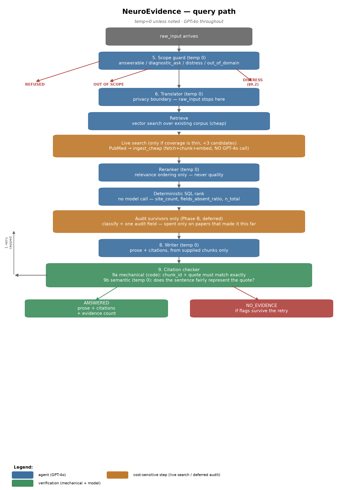

# NeuroEvidence

A multi-agent question-answering system over neurodevelopmental research literature (autism, ADHD, dyslexia, dyspraxia, Tourette's). It answers questions about what the research establishes — it does not assess or diagnose the person asking. See `docs/neuroevidence-working-spec.md` for the full design and its reasoning.

## Query path



Every agent runs on GPT-4o at temperature 0 — including the writer, moved off an original 0.2 after real testing showed the higher temperature let it embellish thin citations with uncited specifics. No agent selects a tool or decides what runs next; the pipeline itself is plain code.

A pre-built literature corpus isn't affordable at the current budget, so retrieval checks what's already known first, and only searches PubMed live — cheaply ingesting (fetch, chunk, embed) everything found — when coverage is thin. The expensive classify-and-audit step then runs only on the papers that survive reranking as actually relevant, never on every paper a search happens to return.

Citations are inline in the answer text (`[1]`, `[2]`, ...) and verified in two layers before anything is shown: a mechanical check (does the quote exist verbatim in the source) and a semantic check (does the sentence fairly represent what the quote says). A flagged citation triggers one capped retry; if it's still flagged, the turn ends honestly at `no_evidence` rather than shipping an unverified claim.

Answers report **counts, never a probability** — how many independent papers were cited, and the largest site count among them. There's no calibration target for a confidence score in this literature, so the system doesn't manufacture one (`docs/neuroevidence-working-spec.md` §2.3).

## Setup

See `docs/setup.md` for the full account/API-key checklist. Quick version:

```bash
uv sync
# fill in .env — see docs/setup.md for what each key is and where to get it
# run supabase/schema.sql, then supabase/seed_quality_fields.sql, then
# supabase/query_functions.sql, in the Supabase SQL editor
uv run uvicorn neurodiversity.api.main:app --reload
```

Swagger docs are then available at `http://localhost:8000/docs`.

## Project structure

```
neurodiversity/
├── agents/          # the 11 agents + reranker — one fixed prompt, one schema-constrained call each
├── ingestion/        # paper fetch, license-gating, chunk+embed, classify+audit
├── nonliterature/     # NICE / MHRA / openFDA — the non-evidence lane, kept isolated from ranking
├── query/             # retrieval, live search, deterministic ranking, the query-path state machine
├── db/                # Supabase clients and Pydantic models
└── api/               # FastAPI app and the discriminated-union response schema

docs/                  # the working spec, architecture map, agent prompts, gold answer, setup checklist
supabase/              # schema.sql, seed data, query-path SQL functions
scripts/               # batch ingestion test, live query-path test, diagram generator
```

## Documentation

- `docs/neuroevidence-working-spec.md` — the design, and why each constraint exists
- `docs/architecture.md` — the system map
- `docs/agents.md` — every agent's model, temperature, and prompt
- `docs/gold-answer.md` — the hand-answered reference question everything else is measured against
- `docs/setup.md` — account and API key checklist
